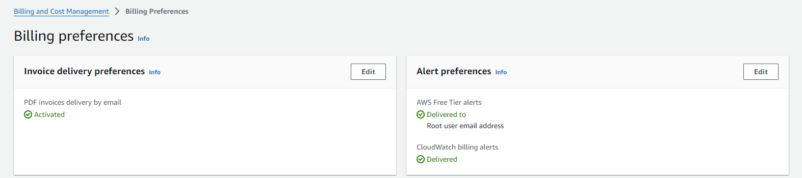
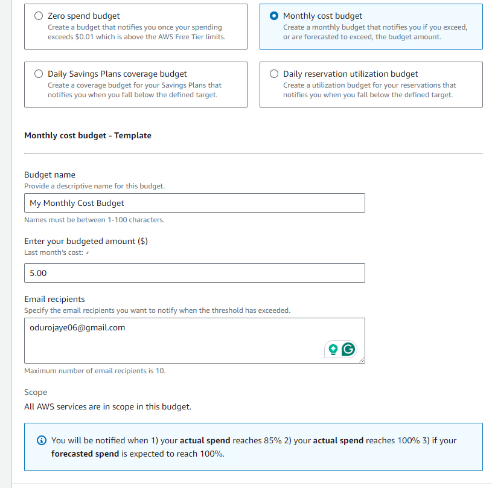

# How to Set Up and Configure Billing Alarms in AWS

## Introduction
This guide will walk you through the steps to set up and configure billing alarms in your AWS account. Billing alarms help you monitor your AWS usage and ensure you stay within your budget.

## Step 1: Log in to the AWS Account
1. Log in to your AWS root user account.
2. Choose the desired AWS region.

## Step 2: Access IAM Dashboard
1. In the AWS Management Console, search for **IAM** and click on it.
  

## Step 3: Create an Account Alias
1. In the IAM dashboard, under **AWS Account**, locate **Account Alias**.
2. Click on **Create an alias** and enter a unique alias (e.g., `segun-lab`).

## Step 4: Modify Account Settings
1. Click on your alias name at the top left corner.
2. Select **Account** from the dropdown.

## Step 5: Activate IAM Access to Billing Information
1. Scroll down to **IAM user and role access to Billing Information**.
2. Check the box to **Activate IAM Access**.

## Step 6: Configure Billing Preferences
1. On the left-hand side, click on **Billing preferences**.
2. Under **Alert Preference**, check the following options:
   - **Receive AWS Free Tier Alert**
   - **Receive CloudWatch billing alert**
3. On the right-hand side, enable **PDF invoices delivery by mail**.

## Step 7: Set a Monthly Cost Budget
1. Click on **Budgets** and set a monthly cost budget.
  

## Step 8: Use Cost Explorer
1. Click on **Cost Explorer** to see a breakdown of your spending.

## Conclusion
By following these steps, you will have successfully set up and configured billing alarms in your AWS account. This will help you keep track of your spending and avoid unexpected charges.

