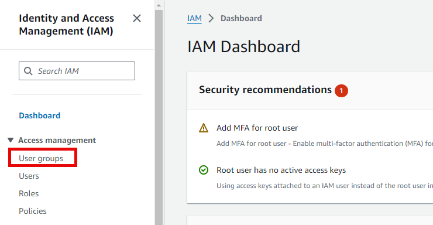

# How to Create an IAM User

In this guide, we will walk through the steps required to create an IAM user in AWS and assign them to a user group for better access management.

---

## Step 1: Access the AWS Console

1. Visit the [AWS Management Console](https://console.aws.amazon.com/).
2. In the search bar, type `IAM` and select it from the results to navigate to the IAM dashboard.


## Step 2: Create a User Group

It's a best practice to assign users to groups and grant permissions through group policies. This approach simplifies user management and ensures that access control is consistent.

1. From the IAM dashboard, click on **User groups**.  
 
   
2. Click on **Create user group**.

3. In the **Group Name** field, provide a meaningful name for the group, such as `"Admins"`.

4. Under the **Attach Permission Policies** section, search for and select the `AdministratorAccess` policy. This policy grants full administrative access to AWS resources.

    Here is the JSON of the `AdministratorAccess` policy:
    ```json
    {
        "Version": "2012-10-17",
        "Statement": [
            {
                "Effect": "Allow",
                "Action": "*",
                "Resource": "*"
            }
        ]
    }
    ```

5. After assigning the permission policy, click on **Create group** to finalize the process. Now, you've created a group with administrative access.

## Step 3: Create an IAM User

Now that the user group is created, you can proceed to create an IAM user and assign them to this group to inherit the group’s permissions.

1. From the IAM dashboard, click on **Users**.  
 

2. Click on **Add user**.

3. Provide a **User Name**, for example, `"segun"`.

4. Under **Access type**, enable **AWS Management Console access** to allow the user to log in to the AWS console.

5. Choose the option to create a custom password or auto-generate one.
 


## Step 4: Set User Permissions

After configuring the basic details of the user, the next step is to assign permissions.

1. On the **Set permissions** page, choose **Add user to group**.

2. Toggle the checkbox for the `Admins` group (or the name of the group you created in Step 2). This will allow the new user to inherit all the permissions attached to the group.
 

## Step 5: Review and Create the User

1. Review the user configuration and permissions.
2. Click on **Create user** to complete the process.

Once the user is created, you can share the login credentials with the user to access the AWS Management Console with the inherited permissions of the `Admins` group.

# Types of Policies in AWS

AWS offers several types of policies to help manage permissions and security in your cloud environment. These policies define who has access to what resources and what actions they are allowed to perform. Below are the key types of policies:

## 1. Identity-Based Policy

An **Identity-Based Policy** is a policy attached directly to an IAM user, group, or role. These policies control what actions that identity (user, group, or role) is allowed to perform on specified AWS resources. There are two types of identity-based policies:

- **Managed Policies**: Created and managed by AWS or the customer, these policies can be attached to multiple users, groups, or roles.
- **Inline Policies**: Embedded directly within an IAM user, group, or role. These policies are specific to one user, group, or role and cannot be reused.

**Example of a Managed Policy:**

```json
{
    "Version": "2012-10-17",
    "Statement": [
        {
            "Effect": "Allow",
            "Action": "s3:*",
            "Resource": "*"
        }
    ]
}
```

## 2. Resource-Based Policy
A Resource-Based Policy is attached directly to an AWS resource (e.g., an S3 bucket or Lambda function) rather than to an identity. These policies specify which principals (users, accounts, services) can access the resource and under what conditions.

Resource-based policies support cross-account access, allowing you to grant permissions to users or services in other AWS accounts.

Example of an S3 Bucket Policy:

```json
{
    "Version": "2012-10-17",
    "Statement": [
        {
            "Effect": "Allow",
            "Principal": {
                "AWS": "arn:aws:iam::123456789012:user/Alice"
            },
            "Action": "s3:GetObject",
            "Resource": "arn:aws:s3:::example-bucket/*"
        }
    ]
}
```

## 3. IAM Permission Boundary
A Permission Boundary is an advanced feature that defines the maximum permissions that an IAM user or role can have. Even if a policy grants more permissions, the user or role can only perform actions allowed by the permission boundary. This helps in preventing privilege escalation and ensuring that users or roles do not gain more permissions than intended.

For example, you can use permission boundaries to limit the scope of what IAM users or roles can do, even if they are assigned broader permissions in their identity-based policies.

Example of a Permission Boundary:

```json
{
    "Version": "2012-10-17",
    "Statement": [
        {
            "Effect": "Allow",
            "Action": "s3:*",
            "Resource": "arn:aws:s3:::example-bucket/*"
        }
    ]
}
```

## 4. AWS Organizations Service Control Policy (SCP)

A Service Control Policy (SCP) is used within AWS Organizations to manage permissions at the organization or organizational unit (OU) level. SCPs allow you to restrict what services and actions can be used across AWS accounts within an organization. They act as a guardrail to enforce consistent permissions across accounts, preventing even administrators in child accounts from performing actions that the SCP prohibits.

SCPs do not grant permissions on their own but serve as a way to limit the permissions that can be granted by identity-based or resource-based policies.

Example of a Service Control Policy (SCP):

```json
{
    "Version": "2012-10-17",
    "Statement": [
        {
            "Effect": "Deny",
            "Action": [
                "ec2:RunInstances",
                "rds:CreateDBInstance"
            ],
            "Resource": "*"
        }
    ]
}
```

By understanding these different types of policies, you can implement precise access control and security strategies in AWS, helping ensure that users have the appropriate permissions while adhering to security best practices.
