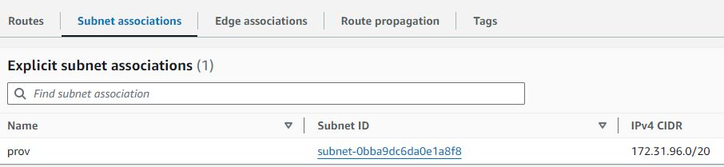

# How to SSH into an EC2 Instance in a Private Subnet

This guide covers the steps to securely SSH into an EC2 instance that resides in a private subnet by using a public EC2 instance as a jump server within the same Availability Zone.


## Prerequisites

For illustration purposes, we will create two EC2 instances in the same Availability Zone:

- One EC2 instance in a private subnet (no direct internet access)
- Another EC2 instance in a public subnet (internet access enabled)

## Step 1: Create a Private Subnet

1. Log in to your AWS Console.

2. In the AWS Console, search for VPC and open the VPC dashboard.

3. Go to Subnets to view the list of available subnets. Sort the IPv4 CIDR column and take note of how the IPs are assigned.


4. Click on Create Subnet. A page will display with options to configure your new subnet.

5. Set Up Subnet Details:
- Name: Enter a name for the subnet, for example, Prov.
- Availability Zone: Choose a preferred Availability Zone, as both EC2 instances will be deployed here.
- IPv4 CIDR Block: Enter the next available IPv4 CIDR range. For this example, we’ll use 172.31.96.0/20.
- Click Create Subnet to finalize subnet creation.

## Step 2: Create a Route Table

1. In the VPC dashboard, select Route Tables.

2. Click Create Route Table and provide a name for the route table, such as Default-VPC-private.

3. VPC: Select your default VPC.

4. Click Create Route Table to complete the process.

5. Associate Subnet with Route Table:
- Select the newly created route table.
- Navigate to the Subnet Associations tab.
- Choose Edit subnet associations, then associate the route table with the private subnet you created.



## Step 3: Launch EC2 Instances in the Availability Zone

Now that the subnets are ready, we’ll launch two EC2 instances in the same Availability Zone:

1. Instance 1 (Public Subnet):

- Launch an EC2 instance and select the public subnet in the same Availability Zone as the private subnet.
E- nsure the instance has an Elastic IP and Security Group that allows SSH access from your IP.

2. Instance 2 (Private Subnet):

- Launch a second EC2 instance in the private subnet.
- Configure the instance’s Security Group to allow SSH access only from the IP address of the public EC2 instance.

## Step 4: SSH into the Private Instance via the Public Instance

To connect to the private EC2 instance, use the public EC2 instance as a jump server.

1. SSH into Public Instance:

```bash
ssh -i /path/to/your-key.pem ec2-user@<Public-Instance-IP>
```

2. SSH from Public to Private Instance: From the public EC2 instance, use SSH to connect to the private instance

```bash
ssh -i /path/to/your-key.pem ec2-user@<Private-Instance-IP>
```

This allows you to securely access the private EC2 instance without exposing it to the internet.


