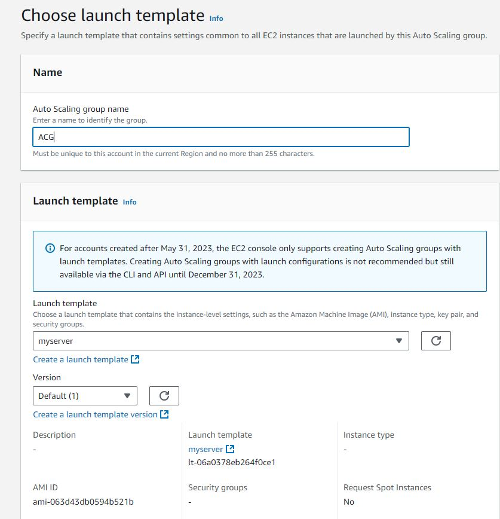
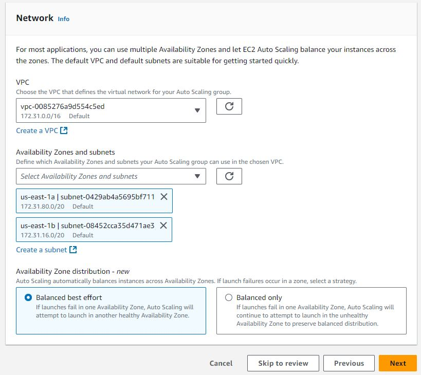

# How to Create a simple Auto Scaling Group

## Overview

This guide walks you through setting up a basic Auto Scaling Group in AWS, allowing you to automatically scale your EC2 instances to meet demand. We start by creating a launch template, then proceed to configure the Auto Scaling Group.

## Step 1: Create a Launch Template

The launch template defines the configuration for your EC2 instances. For this example, we’ll use a `simple user` data script to set up a web server that displays the Availability Zone in which the instance is running.

1. Open the Launch Templates section in your EC2 Console.

2. Create a new Launch Template and provide the following user data to install and configure Apache:

```bash
#!/bin/bash

# Update the system and install necessary packages
yum update -y
yum install -y httpd

# Start the Apache server
systemctl start httpd
systemctl enable httpd

# Fetch the Availability Zone information using IMDSv2
TOKEN=`curl -X PUT "http://169.254.169.254/latest/api/token" -H "X-aws-ec2-metadata-token-ttl-seconds: 21600"`
AZ=`curl -H "X-aws-ec2-metadata-token: $TOKEN" http://169.254.169.254/latest/meta-data/placement/availability-zone`

# Create the index.html file
cat > /var/www/html/index.html <<EOF
<html>
<head>
    <title>Instance Availability Zone</title>
    <style>
        body {
            background-color: #6495ED;
            color: white;
            font-size: 36px;
            display: flex;
            justify-content: center;
            align-items: center;
            height: 100vh;
            margin: 0;
            font-family: Arial, sans-serif;
        }
    </style>
</head>
<body>
    <div>This instance is located in Availability Zone: $AZ</div>
</body>
</html>
EOF

# Ensure the httpd service is correctly set up to start on boot
chkconfig httpd on
```

3. Save the Launch Template after adding all necessary configurations.

## Step 2: Create an Auto Scaling Group

Once your launch template is ready, you can create the Auto Scaling Group.

1. Visit the Auto Scaling Groups section in your EC2 Console (Auto Scaling Groups Console).

Create a New Auto Scaling Group: Name your Auto Scaling Group.



2. Configure Network Settings: Scroll down to the Network section. Select two different public Availability Zones for redundancy.



3. Load Balancing Section: For this example, leave the Load Balancing section at the default settings.

4. Configure Group Size: for this example, we need 2 instances to be continuously running.


5. Keep all other settings as default and launch the Auto Scaling Group.

## Conclusion

You’ve now set up a simple Auto Scaling Group using a launch template that runs a web server showing the Availability Zone. This configuration ensures that your application has the necessary resources to scale based on demand.


